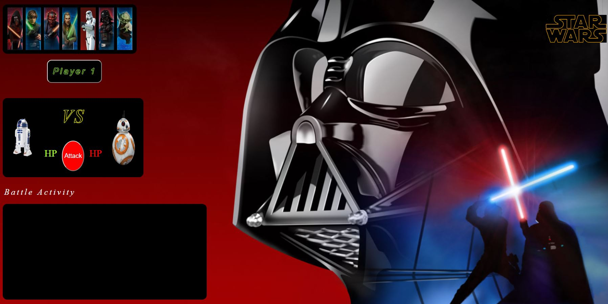

# StarWars-RPG
Star Wars RPG - Select a character and defeat all opponents that stand in your way!

## Deployed Application:
https://sthmpsn.github.io/StarWars-RPG/

## Instructions
* Choose your character by clicking a character and the selecting the "Player 1" button
* After selecting your character, choose your first opponent by selecting a character to battle and click the "CPU" button
* In the Battle Arena you click the "Attack" button to initiate the first attack against your opponent
* Your opponent will counter attack
* Once your opponent is defeated, select the next opponent until you or they are all defeated
* Review Battle Activity log to see the activity taking place

**Note:** Hover over a character to see their characteristics
**Note:** This game has sound

## Technologies
* HTML  
* CSS  
* Javascript  
* jquery  
* Bootstrap  

## Screenshots

## Contributors
* Steve Thompson (sthmpsn)
